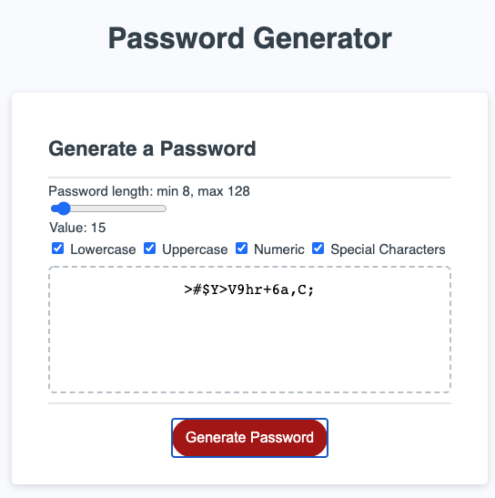

# Assignment: JavaScript Password Generator
I created an application that generates a random password based on user-selected criteria. 
I opted to use a slider and checkbox inputs vs prompts to solicit input from the user.
The user has the ability to choose a password length between 8 & 128 as well as include the following criteria: lowercase, uppercase, numeric, and/or special characters.
They must select at least one criteria and will be alerted if they have not.

# Screenshots of Project

